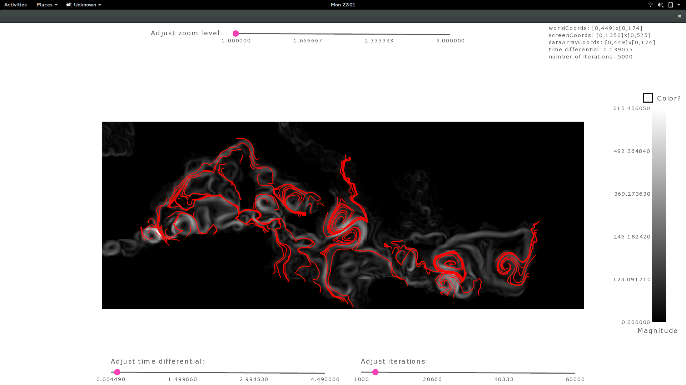

# DataVisualizations
Designed and implemented various interactive data visualization tools as part of class curriculum.
## Scatterplot

## Scatterplot Matrix

## Parallel Coordinates

## Hybrid Parallel Coordinates

## Slice View

## Isosurface

## Transfer Function

## Vector Field

